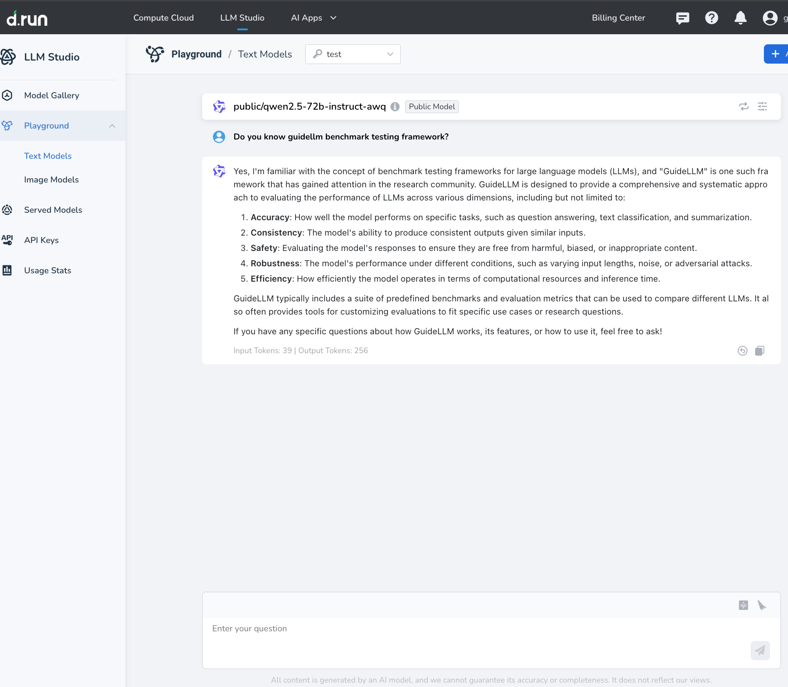
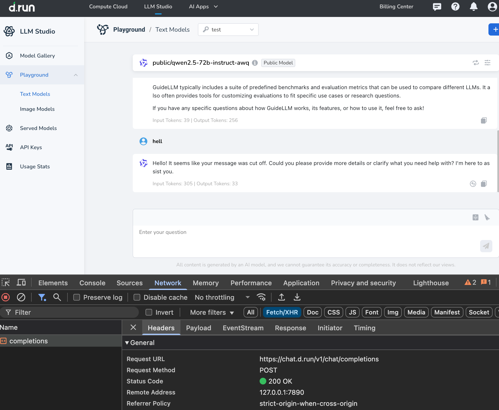
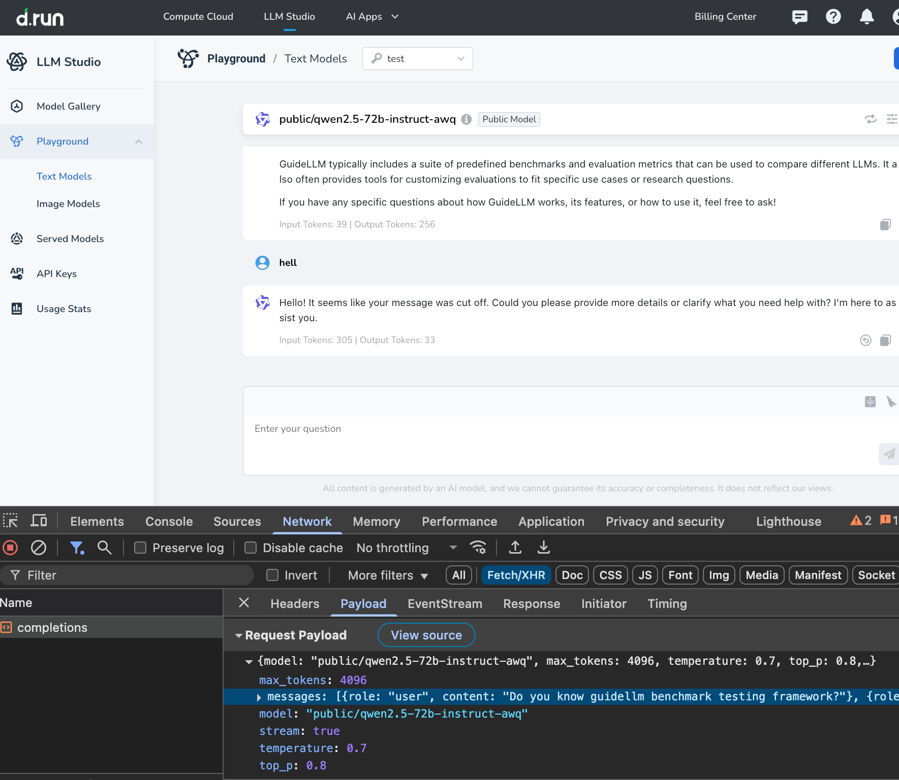
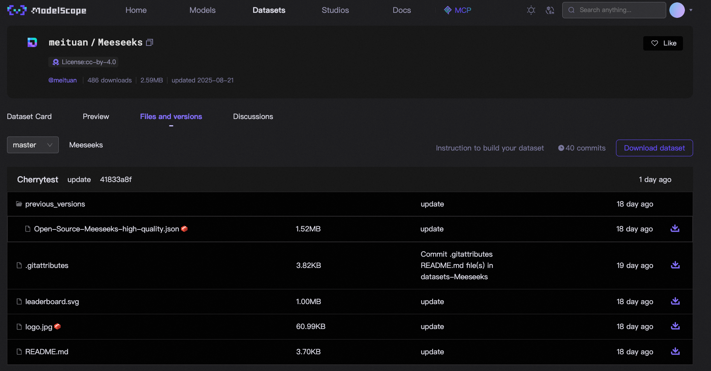
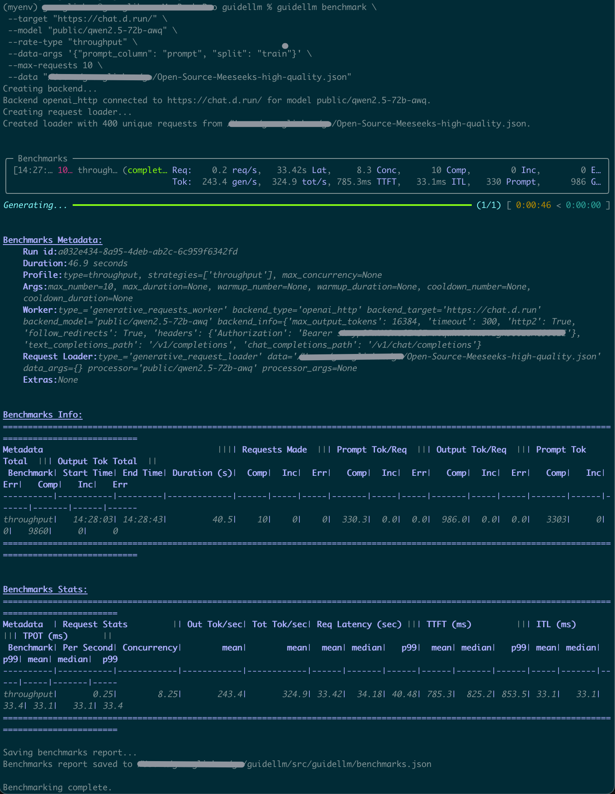

# GuideLLM Benchmark Testing Best Practices

[https://console.d.run/](https://console.d.run/) is one AI infrastructure platform in which there are some deployed model playgrounds. Now, one `guidellm` benchmark testing practice example will be based on one chat model.

## Getting Started

### 📦 1. Benchmark Testing Environment Setup

#### 1.1 Create a Conda Environment (recommended)

```bash
conda create -n guidellm-bench python=3.11 -y
conda activate guidellm-bench
```

#### 1.2 Install Dependencies

```bash
git clone https://github.com/vllm-project/guidellm.git
cd guidellm
pip install guidellm
```

For more detailed instructions, refer to [GuideLLM README](https://github.com/vllm-project/guidellm/blob/main/README.md).

#### 1.3 Verify Installation

```bash
guidellm --help
```

#### 1.4 Apply for Account and API Key in D.run

Firstly, register an account, refer to [D.run Registration](https://docs.d.run/en/#register-account); then, create an API key, refer to [D.run API Key](https://docs.d.run/en/#register-account); finally, charge your account at [D.run Account Management](https://docs.d.run/en/#register-account).

#### 1.5 Chat with Model in D.run

Check if you can use the chat model in D.run.



#### 1.6 Find Out the HTTP Request URL and Body

Use the Developer Tool in Chrome browser or press F12 to open Network, then chat with the LLM model to capture the HTTP request URL and body.





In this request, the vllm backend service URL is `https://chat.d.run`; vllm model is `public/qwen2.5-72b-instruct-awq`. These two pieces of information will be used in the following benchmark command.

#### 1.7 Download a Chat Dataset from Modelscope

Download the chat dataset JSON file `Open-Source-Meeseeks-high-quality.json` from [Modelscope - Meeseeks](https://modelscope.cn/datasets/meituan/Meeseeks/files).



______________________________________________________________________

## 🚀 2. Running Benchmarks

```bash
export GUIDELLM__OPENAI__API_KEY="${api_key}"
guidellm benchmark \
 --target "https://chat.d.run/" \
 --model "public/qwen2.5-72b-awq" \
 --rate-type "throughput" \
 --data-args '{"prompt_column": "prompt", "split": "train"}' \
 --max-requests 10 \
 --data "/{$local_path}/Open-Source-Meeseeks-high-quality.json"
```

______________________________________________________________________

## 📊 3. Results Interpretation



After the benchmark completes, key results are clear and straightforward, such as:

- **`TTFT`**: Time to First Token
- **`TPOT`**: Time Per Output Token
- **`ITL`**: Inter-Token Latency

The first benchmark test is complete.
