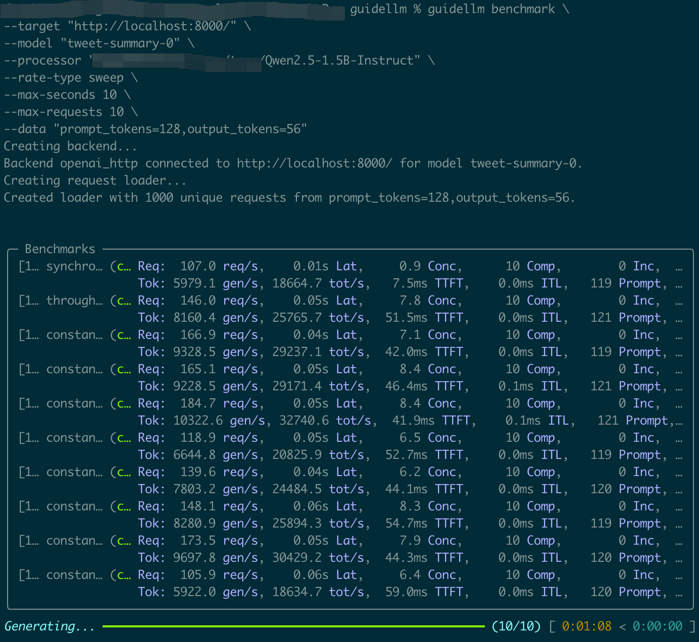
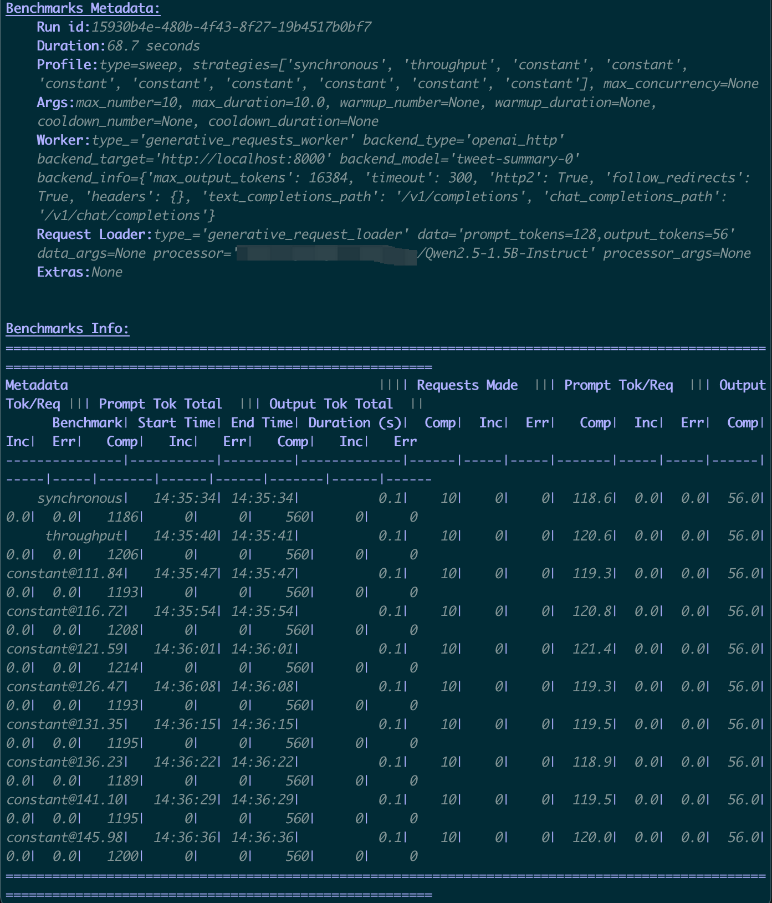
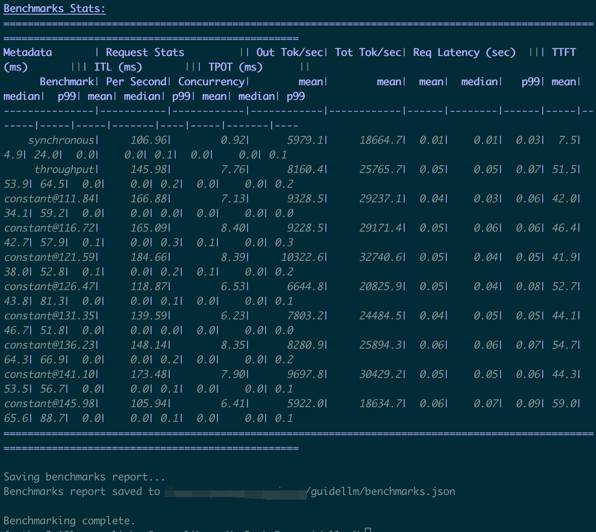

# GuideLLM Benchmark Testing Best Practice

Do first easy-go guidellm benchmark testing from scratch using vLLM Simulator.

## Getting Started

### 📦 1. Benchmark Testing Environment Setup

#### 1.1 Create a Conda Environment (recommended)

```bash
conda create -n guidellm-bench python=3.11 -y
conda activate guidellm-bench
```

#### 1.2 Install Dependencies

```bash
git clone https://github.com/vllm-project/guidellm.git
cd guidellm
pip install guidellm
```

For more detailed instructions, refer to [GuideLLM README](https://github.com/vllm-project/guidellm/blob/main/README.md).

#### 1.3 Verify Installation

```bash
guidellm --help
```

#### 1.4 Startup OpenAI-compatible API in vLLM simulator docker container

```bash
docker pull ghcr.io/llm-d/llm-d-inference-sim:v0.4.0

docker run --rm --publish 8000:8000 \
ghcr.io/llm-d/llm-d-inference-sim:v0.4.0  \
--port 8000 \
--model "Qwen/Qwen2.5-1.5B-Instruct"  \
--lora-modules '{"name":"tweet-summary-0"}' '{"name":"tweet-summary-1"}'
```

For more detailed instructions, refer to: [vLLM Simulator](https://llm-d.ai/docs/architecture/Components/inference-sim)

Docker image versions: [Docker Images](https://github.com/llm-d/llm-d-inference-sim/pkgs/container/llm-d-inference-sim)

Check open-ai api working via curl:

- check /v1/models

```bash
curl --request GET 'http://localhost:8000/v1/models'
```

- check /v1/chat/completions

```bash
curl --request POST 'http://localhost:8000/v1/chat/completions' \
--header 'Content-Type: application/json' \
--data-raw '{
    "model": "tweet-summary-0",
    "stream": false,
    "messages": [{"role": "user", "content": "Say this is a test!"}]
}'
```

- check /v1/completions

```bash
curl --request POST 'http://localhost:8000/v1/completions' \
--header 'Content-Type: application/json' \
--data-raw '{
    "model": "tweet-summary-0",
    "stream": false,
    "prompt": "Say this is a test!",
    "max_tokens": 128
}'
```

#### 1.5 Download Tokenizer

Download Qwen/Qwen2.5-1.5B-Instruct tokenizer files from [Qwen/Qwen2.5-1.5B-Instruct](https://modelscope.cn/models/Qwen/Qwen2.5-1.5B-Instruct/files) save to local path such as ${local_path}/Qwen2.5-1.5B-Instruct

```bash
ls ./Qwen2.5-1.5B-Instruct
merges.txt              tokenizer.json          tokenizer_config.json   vocab.json
```

______________________________________________________________________

## 🚀 2. Running Benchmarks

```bash
guidellm benchmark \
--target "http://localhost:8000/" \
--model "tweet-summary-0" \
--processor "${local_path}/Qwen2.5-1.5B-Instruct" \
--rate-type sweep \
--max-seconds 10 \
--max-requests 10 \
--data "prompt_tokens=128,output_tokens=56"
```

______________________________________________________________________

## 📊 3. Results Interpretation

  

After the benchmark completes, key results are clear and straightforward, such as:

- **`TTFT`**: Time to First Token
- **`TPOT`**: Time Per Output Token
- **`ITL`**: Inter-Token Latency

The first benchmark test complete.
