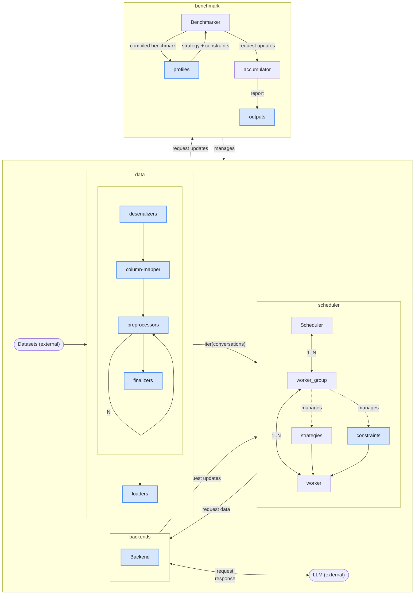

# Architecture

GuideLLM is designed to evaluate and optimize large language model (LLM) deployments by simulating real-world inference workloads. The architecture is modular, enabling flexibility and scalability. Below is an overview of the core components and their interactions.

## Core Components

### 1. **Backend**

The `Backend` is an abstract interface for interacting with generative AI backends. It is responsible for processing requests and generating results. GuideLLM supports OpenAI-compatible HTTP servers, such as vLLM, as backends.

- **Responsibilities:**
  - Accept requests from the `RequestsWorker`.
  - Generate responses for text or chat completions.
  - Validate backend readiness and available models.

### 2. **RequestLoader**

The `RequestLoader` handles sourcing data from an iterable and generating requests for the backend. It ensures that data is properly formatted and ready for processing.

- **Responsibilities:**
  - Load data from datasets or synthetic sources.
  - Generate requests in a format compatible with the backend.

### 3. **DatasetCreator**

The `DatasetCreator` is responsible for loading data sources and converting them into Hugging Face (HF) dataset items. These items can then be streamed by the `RequestLoader`.

- **Responsibilities:**
  - Load datasets from local files, Hugging Face datasets, or synthetic data.
  - Convert data into a format compatible with the `RequestLoader`.

### 4. **Scheduler**

The `Scheduler` manages the scheduling of requests to the backend. It uses multiprocessing and multithreading with asyncio to minimize overheads and maximize throughput.

- **Responsibilities:**
  - Schedule requests to the backend.
  - Manage queues for requests and results.
  - Ensure efficient utilization of resources.

### 5. **RequestsWorker**

The `RequestsWorker` is a worker process that pulls requests from a queue, processes them using the backend, and sends the results back to the scheduler.

- **Responsibilities:**
  - Process requests from the scheduler.
  - Interact with the backend to generate results.
  - Return results to the scheduler.

### 6. **Benchmarker**

The `Benchmarker` wraps around multiple invocations of the `Scheduler`, one for each benchmark. It aggregates results using a `BenchmarkAggregator` and compiles them into a `Benchmark` once complete.

- **Responsibilities:**
  - Manage multiple benchmarks.
  - Aggregate results from the scheduler.
  - Compile results into a final benchmark report.

### 7. **BenchmarkAggregator**

The `BenchmarkAggregator` is responsible for storing and compiling results from the benchmarks.

- **Responsibilities:**
  - Aggregate results from multiple benchmarks.
  - Compile results into a `Benchmark` object.

## Component Interactions

The following diagram illustrates the relationships between the core components:
