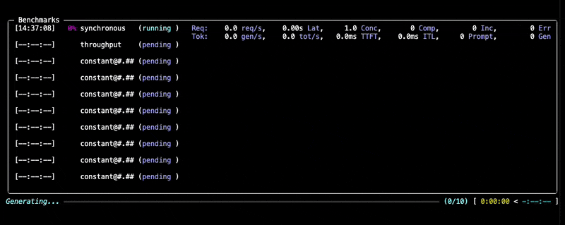

# 运行基准测试

1. [安装 GuideLLM](install.md)
2. 运行 GuideLLM 有两种方式：
   1. 将一个正在运行的 OpenAI 兼容 LLM 服务器作为目标
      - 这是最常见的配置。
   2. 使用 vLLM Python 后端，让 vLLM 在同一进程中运行
      - 除了了解如何运行 GuideLLM，还需要了解如何配置 vLLM。
      - 无需单独的服务器，因此可以简化编排。

> [!NOTE]\
> 本指南中的内容适用于这两种后端，后端专属输入除外。
>
> 本指南以 OpenAI HTTP 后端和 OpenAI 兼容 LLM 服务器为前提。有关 vLLM Python 后端的信息，请参阅英文版 [vLLM Python 后端](../../guides/vllm-python-backend.md)文档。

在[启动服务器（英文）](../../getting-started/server.md)后，你就可以运行基准测试来评估 LLM 部署的性能。

## CLI 选项格式

GuideLLM CLI 使用统一的基于注册表的选项格式。通过 `kind=<type>` 选择已注册的实现，并使用 key=value 对配置参数：

```bash
guidellm run --<option> kind=<TYPE>,key=value,...
```

简单设置可以使用逗号分隔的 key=value 对（例如，`--data kind=synthetic_text,prompt_tokens=256,output_tokens=128`）。如果包含嵌套值（例如，`--data '{"kind":"huggingface","source":"org/dataset","loader_kwargs":{"split":"test"}}'`），请使用序列化后的 JSON 或 YAML。不要在同一个选项中混用内联 key=value 和 JSON/YAML。某些选项可以重复指定多个值（例如，多个 `--data` 或 `--constraint` 项）。

你可以使用 `--config`（别名为 `--scenario`、`-c`）加载已保存的场景文件（YAML 或 JSON）。CLI 选项会覆盖场景中的值。

### 基本示例

要使用默认设置对本地 vLLM 服务器运行基准测试：

```bash
guidellm run \
  --backend kind=openai_http,target=http://localhost:8000 \
  --data kind=synthetic_text,prompt_tokens=256,output_tokens=128 \
  --constraint kind=max_duration,seconds=60
```

该命令将：

- 连接到运行在 `http://localhost:8000` 的 vLLM 服务器
- 使用合成数据，每个请求包含 256 个提示 token 和 128 个输出 token
- 自动检测服务器上可用的模型
- 运行 `sweep` 配置（默认值），以找到最佳性能点
- 在每种策略运行 60 秒后停止

基准测试过程中，你会看到类似下面的进度显示：



要进一步了解数据集选项和后端配置，请参阅英文版[数据集文档](../../guides/datasets.md)和[后端文档](../../guides/backends.md)。

## 了解基准测试选项

GuideLLM 提供多种选项来定制基准测试。以下是最重要的一些参数：

### 主要参数

| 参数            | 说明                         | 示例                                                                                       |
| --------------- | ---------------------------- | ------------------------------------------------------------------------------------------ |
| `--backend`     | 后端类型和连接设置           | `--backend kind=openai_http,target=http://localhost:8000,model=Meta-Llama-3.1-8B-Instruct` |
| `--data`        | 数据类型和配置               | `--data kind=synthetic_text,prompt_tokens=256,output_tokens=128`                           |
| `--profile`     | 基准测试配置类型和参数       | `--profile kind=sweep,sweep_size=10`                                                       |
| `--constraint`  | 执行限制（可重复指定）       | `--constraint kind=max_requests,count=1000`                                                |
| `--seed`        | 用于确保结果可复现的随机种子 | `--seed kind=static,value=42`                                                              |
| `--data-loader` | 样本数量和加载器设置         | `--data-loader kind=pytorch,samples=1000`                                                  |
| `--output`      | 输出格式和路径（可重复指定） | `--output kind=json,path=results/benchmark.json`                                           |
| `--tokenizer`   | 用于 token 计数的 tokenizer  | `--tokenizer kind=huggingface_auto,model=gpt2`                                             |

### 随机种子（`--seed`）

随机种子用于 GuideLLM 中涉及随机性的操作，例如合成数据生成或 Poisson 策略调度。默认值是固定的，因此使用相同参数重新运行 GuideLLM 应得到相同结果：

```bash
--seed kind=static,value=42
```

### 约束（`--constraint`）

约束决定配置中的每种策略何时停止。可以添加一个或多个 `--constraint` 选项。约束分别应用于配置中的每种策略。包含多种策略的配置包括 `sweep`，以及主要参数为列表的任何配置（例如 `concurrent` 中的 `{"streams":[10,20]}`）。

| 约束类型                | 配置参数          | 示例                                                             |
| ----------------------- | ----------------- | ---------------------------------------------------------------- |
| `max_duration`          | `seconds`         | `--constraint kind=max_duration,seconds=30`                      |
| `max_requests`          | `count`           | `--constraint kind=max_requests,count=1000`                      |
| `min_requests`          | `count`           | `--constraint kind=min_requests,count=1000`                      |
| `max_errors`            | `count`           | `--constraint kind=max_errors,count=10`                          |
| `max_error_rate`        | `rate`, `window`  | `--constraint kind=max_error_rate,rate=0.05,window=10`           |
| `max_global_error_rate` | `rate`, `minimum` | `--constraint kind=max_global_error_rate,rate=0.05,minimum=1000` |
| `over_saturation`       | 检测参数          | `--constraint kind=over_saturation,min_seconds=30,mode=enforce`  |

例如，在 `--profile kind=sweep` 下使用 `--constraint kind=max_requests,count=1000`，会让扫描中的每种策略（同步、吞吐量，以及每个插值速率）最多运行 1000 个请求。`--constraint kind=min_requests,count=1000` 与 `max_requests` 类似，但会继续排队，直到处理完 1000 个请求；这样可以避免基于速率的基准测试在结束时吞吐量下降。使用 `--profile '{"kind":"concurrent","streams":[10,20]}'` 配合 `--constraint kind=max_duration,seconds=30`，则会先以 10 个并发流运行 30 秒，再以 20 个并发流运行 30 秒。

有关过饱和约束的详细信息，请参阅英文版[过饱和停止策略](../../guides/over_saturation_stopping.md)。

### 子基准测试（每种策略）约束

使用 `sweep` 配置、在 `async`/`constant`/`poisson` 配置中指定多个 `rate` 值，或在 `concurrent` 配置中指定多个 `streams` 值时，配置中会运行多个“基准测试策略”。GuideLLM 允许使用 `--override` 选项为约束指定不同的控制参数。例如，`--profile kind=sweep,sweep_size=5 --constraint kind=max_duration,seconds=30` 会运行 5 种策略（同步、吞吐量，以及 3 个插值后的 constant 速率），每种运行 30 秒。你可以使用 `--override constraint[0].seconds 10,20,10,15,20`，让同步策略运行 10 秒、吞吐量策略运行 20 秒，并让 3 个插值后的 constant 策略分别运行 10 秒、15 秒和 20 秒。若指定的值较少（例如 `--override constraint[0].seconds 10,20,10`），最后一个值 10 秒会应用于其余所有 constant 策略。

### 基准测试配置（`--profile`）

GuideLLM 支持多种基准测试配置，下面将逐一介绍。配置专属参数与 `kind=<type>` 放在同一个配置字符串中。

#### 同步配置

每次只按顺序运行一个请求。

```bash
guidellm run --profile kind=synchronous
```

| 配置参数 | 说明       | 示例 |
| -------- | ---------- | ---- |
| —        | 无速率参数 |      |

#### 吞吐量配置

通过持续并行发送请求，尝试找出服务器的最大吞吐量。

```bash
guidellm run --profile kind=throughput,max_concurrency=10
```

| 配置参数          | 说明                     | 示例                                                              |
| ----------------- | ------------------------ | ----------------------------------------------------------------- |
| `max_concurrency` | 并发请求流的数量         | `--profile kind=throughput,max_concurrency=10`                    |
| `rampup_duration` | 增加到最大吞吐量所需秒数 | `--profile kind=throughput,max_concurrency=10,rampup_duration=10` |

#### 并发配置

运行固定数量的并行请求流。

```bash
guidellm run --profile kind=concurrent,streams=10
```

| 配置参数          | 说明                         | 示例                                                                                            |
| ----------------- | ---------------------------- | ----------------------------------------------------------------------------------------------- |
| `streams`         | 要维持的并发流数；可以是列表 | `--profile kind=concurrent,streams=10` 或 `--profile '{"kind":"concurrent","streams":[16,32]}'` |
| `rampup_duration` | 分散初始请求的秒数           | `--profile kind=concurrent,streams=10,rampup_duration=10`                                       |
| `max_concurrency` | 可调度的最大并发请求数       | `--profile kind=concurrent,streams=10,max_concurrency=10`                                       |

你可以使用 `--override` 选项指定一组 stream 值，从而以不同 stream 数运行多种并发“策略”（子基准测试）。例如，`--profile kind=concurrent --override profile.streams 10,20,30` 会分别以 10、20 和 30 个 stream 运行并发策略。

#### Knee 配置

先测量一组并发点，再估算输出吞吐量不再显著增长的位置。将 `adaptive=true` 可围绕该估算值再运行一组测试点。默认禁用自适应细化。

```bash
guidellm run \
  --profile '{"kind":"knee","initial_streams":[1,5,10,20,40,80,160],"adaptive":true,"points_each_side":5,"max_step":3}'
```

该配置的两个阶段都使用并发策略，并将初始分析、自适应计划和最终分析写入报告的 `conclusions` 列表。有关配置和计算细节，请参阅英文版 [Knee Profile 指南](../../guides/knee_detection.md)。

如需使用均匀间隔的起始点，请运行 `--profile '{"kind":"knee","min_streams":1,"max_streams":9,"count":5}'`。需要自行选择每个并发点时，请使用 `initial_streams`。

#### Constant 配置

以固定的每秒请求数发送异步请求。

（`async` 和 `constant` 是该配置的别名。）

```bash
guidellm run --profile '{"kind":"constant","rate":[16,32]}'
```

| 配置参数          | 说明                          | 示例                                                                                  |
| ----------------- | ----------------------------- | ------------------------------------------------------------------------------------- |
| `rate`            | 每秒请求数；可以是列表        | `--profile kind=constant,rate=10` 或 `--profile '{"kind":"constant","rate":[16,32]}'` |
| `rampup_duration` | 从 0 线性增加到目标速率的秒数 | `--profile kind=constant,rate=10,rampup_duration=10`                                  |
| `max_concurrency` | 可调度的最大并发请求数        | `--profile kind=constant,rate=10,max_concurrency=32`                                  |

你可以使用 `--override` 选项指定一组速率值，以不同速率运行多种 constant“策略”（子基准测试）。例如，`--profile kind=constant --override profile.rate 10,20,30` 会分别以每秒 10、20 和 30 个请求运行 constant 策略。

#### Poisson 配置

围绕指定的目标速率，按照 Poisson 分布以变化的速率发送异步请求。这种概率模式可用于模拟更真实的实际流量。

```bash
guidellm run --profile kind=poisson,rate=16 --seed kind=static,value=42
```

| 配置参数          | 说明                         | 示例                                                                                |
| ----------------- | ---------------------------- | ----------------------------------------------------------------------------------- |
| `rate`            | 每秒目标请求数；可以是多个值 | `--profile kind=poisson,rate=10` 或 `--profile '{"kind":"poisson","rate":[10,20]}'` |
| `max_concurrency` | 可调度的最大并发请求数       | `--profile kind=poisson,rate=10,max_concurrency=32`                                 |

指定多个速率并配置 `stopping_scope="all"` 的约束（例如过饱和或错误率限制）时，一旦触发约束，列表中剩余的速率都会被跳过。为获得最佳效果，请按升序指定速率，这样只有更高（更难达到）的速率会被跳过。如果速率未按升序排列，失败速率之后的较低速率也会一并跳过。

使用 `--seed kind=static,value=42` 可以让 Poisson 调度结果可复现。

你可以使用 `--override` 选项指定一组速率值，以不同速率运行多种 Poisson“策略”（子基准测试）。例如，`--profile kind=poisson --override profile.rate 10,20,30` 会分别以每秒 10、20 和 30 个请求运行 Poisson 策略。

#### Sweep 配置

Sweep 配置会按顺序运行一系列基准测试策略，以找到给定模型和数据的最佳性能点。

1. 运行 `synchronous` 策略以测量基准速率；
2. 然后运行 `throughput` 策略以确定峰值吞吐量；
3. 最后运行一系列异步策略，其速率在基准速率和最大吞吐量之间插值。（插值策略的数量为 `sweep_size` 减 2。）异步阶段使用的策略类型由 `strategy_type` 参数决定，默认为 `constant`。异步阶段中，如果某个速率触发了 `stopping_scope="all"` 约束，剩余速率会被跳过。

例如，以下命令会运行包含 10 种策略、预热时长为 10 秒且策略类型为 `poisson` 的 sweep：

```bash
guidellm run --profile kind=sweep,sweep_size=10,rampup_duration=10,strategy_type=poisson
```

| 配置参数          | 说明                                              | 示例                                                    |
| ----------------- | ------------------------------------------------- | ------------------------------------------------------- |
| `sweep_size`      | sweep 中策略的总数（包括同步和吞吐量策略）        | `--profile kind=sweep,sweep_size=10`                    |
| `rampup_duration` | 吞吐量和 constant 策略步骤的速率预热时长（秒）    | `--profile kind=sweep,sweep_size=10,rampup_duration=10` |
| `strategy_type`   | 插值步骤使用的策略类型（`constant` 或 `poisson`） | `--profile kind=sweep,strategy_type=poisson`            |
| `max_concurrency` | 可调度的最大并发请求数                            | `--profile kind=sweep,max_concurrency=10`               |

#### Replay 配置

根据 trace 文件数据集中的时间戳重放 trace 事件。有关数据设置，请参阅下文的[trace 回放基准测试](#trace-replay-benchmarking)。

```bash
guidellm run --profile kind=replay,time_scale=1.0
```

| 配置参数        | 说明                                                                                              | 示例                                            |
| --------------- | ------------------------------------------------------------------------------------------------- | ----------------------------------------------- |
| `time_scale`    | trace 事件之间时间间隔的时间缩放比例                                                              | `--profile kind=replay,time_scale=2.0`          |
| `schedule_turn` | `idle_gap`（默认值）保留每次记录的请求耗时之后的空闲间隔；`timestamp` 则以每个 trace 时间戳为目标 | `--profile kind=replay,schedule_turn=timestamp` |

等待上限和数据侧的 `time_scale` 在 `--data` 中设置。构建好数据集时间戳后，调度器会再应用配置中的 `time_scale`，因此可以在多次运行中使用不同的时间缩放比例。

默认的 `schedule_turn=idle_gap` 会保留记录的请求耗时之后的间隔：例如，一个请求记录为 1 秒，下一条时间戳比它晚 5 秒，那么下一个请求会在前一个请求实际完成 4 秒后开始。延迟或变慢的请求会使后续所有请求顺延。如果 trace 中没有耗时列，加载器会记录一条警告，并将每个请求视为瞬时完成；在上述示例中，下一个请求会在前一个请求完成 5 秒后开始。数据配置中的 `duration_column` 可指定耗时列名（默认值为 `duration`）。`schedule_turn=timestamp` 会按每个请求的 trace 时间启动请求，并且仅当前一个请求仍在执行时才等待。

## 数据选项

### 合成数据选项

使用 `synthetic_text` 数据类型并指定所需参数。主要选项包括：

- `prompt_tokens`：提示的平均 token 数（必需）
- `output_tokens`：输出的平均 token 数（可选；对于 embedding 等不产生输出 token 的端点，可以省略）

例如，要使用 100 个提示 token 和 50 个输出 token 运行基准测试：

```bash
guidellm run \
  --backend kind=openai_http,target=http://localhost:8000 \
  --data kind=synthetic_text,prompt_tokens=100,output_tokens=50 \
  --profile kind=constant,rate=5
```

你可以使用标准差、最小值和最大值等其他参数，自定义合成数据生成方式。更多信息请参阅英文版[数据集文档中的 Synthetic data 部分](../../guides/datasets.md#synthetic-data)。

### Trace 回放基准测试 {#trace-replay-benchmarking}

如需进行更贴近实际的负载测试，可以按 trace 每行的时间戳和 token 长度重放事件。trace 数据通过 `--data` 中嵌套的 `source` 配置，从本地文件或 HuggingFace 数据集加载，支持的格式见英文版[Trace 文件格式文档](../../guides/trace_replay.md#supported-formats)。时间戳可以是绝对值或单调值；GuideLLM 会先排序，再转换为相对于首个事件的偏移量：

```json
{"timestamp": 1234500.0, "input_length": 256, "output_length": 128}
{"timestamp": 1234500.5, "input_length": 512, "output_length": 64}
```

在此示例中，第二个请求会安排在第一个请求之后 0.5 秒启动。

使用 `replay` 配置运行：

```bash
guidellm run \
  --backend kind=openai_http,target=http://localhost:8000 \
  --data kind=trace_synthetic,source.kind=json_file,source.path=path/to/trace.jsonl,time_scale=1.0 \
  --profile kind=replay,time_scale=0.5
```

数据参数 `time_scale` 会在应用等待上限和打包上限之后，缩放 trace 事件之间的时间间隔：`1.0` 保持原有时间，`2.0` 将间隔加倍、使运行时间变为两倍，`0.5` 则将间隔缩短一半、使运行速度变为两倍。等待上限（`max_wait`、`max_session_wait`、`min_concurrent_sessions`）会在应用 `time_scale` 前按原始 trace 秒数生效。

你可以使用 `min_concurrent_sessions` 提高并行度。如果打包后的数据集不足以支撑整个基准测试，可以使用 `copies`。默认情况下（`copy_offset=1`），`copies` 会按顺序重放完整的打包 trace：下一轮从上一轮最后一个已调度请求之后开始。`copy_offset` 可以让副本相对于前一轮时间跨度重叠或留出间隔。合成数据 trace 会重新生成 salt，确保各副本中的对话缓存键唯一。

请根据使用场景，在提高并行度和调整请求时间之间作出选择。提高并行度会增加同时处理的请求数，也会增加缓存逐出影响基准测试的可能性。

`--constraint kind=max_duration,seconds=<n>` 不仅会停止启动新请求，也会停止正在等待的请求。等待未来 trace 时间戳的 worker 会在运行时长结束后取消。

GuideLLM 按时间戳顺序调度 trace 行。使用 `--data-loader kind=pytorch,samples=1000` 可以限制加载和重放的 trace 行数。`--constraint kind=max_requests,count=1000` 仍是运行时完成条件，不会截断 trace 数据集。

默认情况下，每种格式都会查找 `timestamp`、`input_length` 和 `output_length` 列。如果 trace 使用了不同的列名，请在数据配置中添加 `timestamp_column`、`prompt_tokens_column` 和 `output_tokens_column`：

```bash
guidellm run \
  --backend kind=openai_http,target=http://localhost:8000 \
  --data kind=trace_synthetic,source.kind=json_file,source.path=replay.jsonl,timestamp_column=timestamp,prompt_tokens_column=input_length,output_tokens_column=output_length \
  --profile kind=replay
```

此功能也适用于特定格式所需的其他列。有关这些额外列及格式专属参数的说明，请参阅英文版 [Trace 文件格式文档](../../guides/trace_replay.md)。

### 使用真实数据

合成数据适合快速测试；你也可以使用真实数据运行基准测试：

```bash
guidellm run \
  --backend kind=openai_http,target=http://localhost:8000 \
  --data kind=json_file,path=/path/to/your/dataset.json \
  --profile kind=constant,rate=5
```

你也可以使用 HuggingFace 上的数据集：

```bash
guidellm run \
  --backend kind=openai_http,target=http://localhost:8000 \
  --data kind=huggingface,source=garage-bAInd/Open-Platypus \
  --profile kind=constant,rate=5
```

## 输出选项

默认情况下，基准测试结果会保存到 `benchmarks.json` 和 `benchmarks.csv`。指定 `--output` 会替换这两个默认输出。有关如何选择输出格式，请参阅英文版[输出配置](../../guides/outputs.md#cli-output-configuration)；有关默认目录和自定义路径，请参阅英文版[文件输出配置](../../guides/outputs.md#configuring-file-outputs)。

### 进度日志

基准测试进度会自动以 INFO 级别记录，包括在非交互式 shell 中也会记录。无需额外的进度选项。每种策略都会记录启动、定期统计信息（更新期间最多每十秒一次）和完成情况。记录包含已用时间、成功/出错/未完成的请求数，以及请求和输出 token 吞吐量。更新依赖调度器回调；发生停滞时，它不会独立充当心跳。

Rich 进度显示可以与日志同时使用。`--disable-console` 和 `--disable-console-interactive` 控制显示内容，不会关闭日志。实际输出哪些记录由现有日志级别决定。只重定向日志时，可以使用 `2>progress.log`；如需保留结构化文件日志，请设置 `GUIDELLM__LOGGING__LOG_FILE_LEVEL=INFO` 和 `GUIDELLM__LOGGING__LOG_FILE=progress.jsonl`。

## 身份验证

对需要身份验证的服务器（例如 OpenAI API）运行基准测试时，请在后端配置中提供 API key。详细信息请参阅英文版 Backends 文档中的 [API Key Configuration](../../guides/backends.md#api-key-configuration) 部分。

## 故障排除

常见问题请参阅英文版[故障排除指南](../../guides/troubleshooting.md)。
